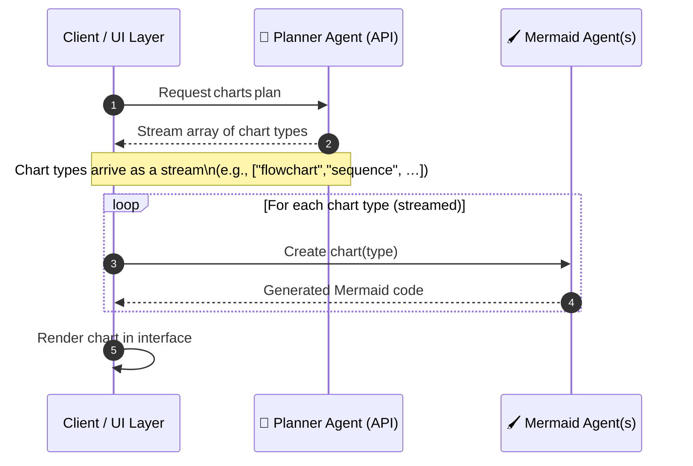

```mermaid
sequenceDiagram
    autonumber
    participant UI as Client / UI Layer
    participant Planner as 🧩 Planner Agent (API)
    participant Mermaid as 🖌️ Mermaid Agent(s)

    %% 1. Ask the planner which charts are needed
    UI->>Planner: Request charts plan
    Planner-->>UI: Stream array of chart types
    Note over Planner,UI: Chart types arrive as a stream\n(e.g., ["flowchart","sequence", …])

    %% 2. For each detected type, trigger a mermaid agent
    loop For each chart type (streamed)
        UI->>Mermaid: Create chart(type)
        Mermaid-->>UI: Generated Mermaid code
    end

    %% 3. Show output as soon as it’s ready
    UI->>UI: Render chart in interface
```
